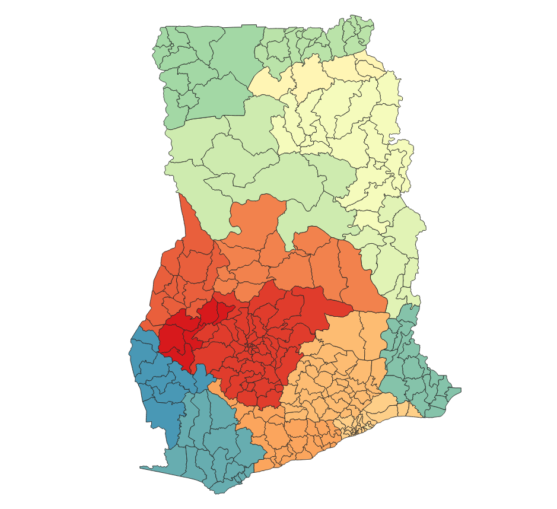
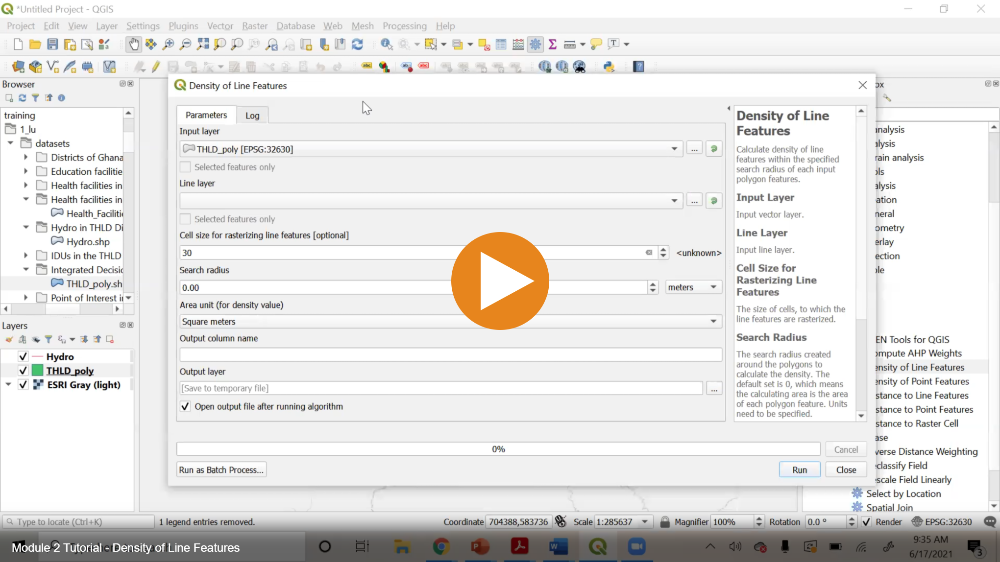

# Level-1 Header: 1 pound sign

**Double asterisks to bold the texts**?

- Create a unordered list with "minus" sign,
- Make the text _Italic_ by wrapping with underscores,
- Italic and bold can be combined **_Row Crops_**.

## 1. Level-2 header: 2 pound signs

**A line break** is treated as a space in _markdown_.
The raw text is on a new line whereas the rendered result continues the
sentence in the same paragraph. 
this can be created with the u tag as well.

Normal Html image tag is supported, which provides more control over the size of the image.

> :bulb: A callout can be created in this format: 
> "br" tag to force a line break
> followed since the early time of land-use suitability modeling.

### Hyperlinks to external sources

1. [Markdown cheatsheet](https://www.markdownguide.org/cheat-sheet/)
2. [Another markdown guide](https://github.com/adam-p/markdown-here/wiki/Markdown-Cheatsheet)

### 1.1 Level-3 header: 3 pound signs

The first step to create a suitability model is to identify the criteria for
the subject of the model.
Each criterion identified should be instrumental in reaching the overall goal
of the model.
For example, if we want to locate a suitable site for an orchard, we might
consider four criteria:

- Soil permeability
- Distance to major roads
- Land value per unit area
- Current land use

Hyperlink to another page on the website.
[Module 2](./Lecture2.md),
**LUCIS-OPEN Tools for QGIS** consists of various geospatial tools to measure
different criteria defined in a suitability analysis, such as *Distance*,
*Density*, and *Zonal Statistics* tools.

## 2. Introduction to QGIS Graphical Modeler

Following is a way to link External videos (on YouTube) to this file. Note that the empty spaces in the path
of the thumbnail is replaced by "%20". Otherwise the link wouldn't work.

 

Following is a video linked to the Mediasite with a UFL domain name.

## 3. Modeling Suitability for Row Crops Farming

Markdown also supports table.

| ID | Input Element | Parameter Name  | Geometry Type | Data used to run the model | Description                                |
|----|---------------|-----------------|---------------|----------------------------|--------------------------------------------|
| 1  | `Vector Layer`| Input Polygon   | Polygon       | *THLD_poly.shp*            | IDUs in the THLD District Assembly         |
| 2  | `Vector Layer`| Major Roads     | Line          | *primary_road.shp*         | Primary road in THLD District              |
| 3  | `Vector Layer`| Secondary Roads | Line          | *secondary_road.shp*       | Secondary road in THLD District            |
| 4  | `String`      | Weighted Value  | n/a           | *0.75,0.25*                | Weights used to sum the different criteria |

> :bulb: Note: 
> Inputs are denoted by  in all diagrams
> throughout this Module (including exercises).

| ID | Input Element  | Parameter Name             | Data Used to Run the Model                 | Description                         |
|----|----------------|----------------------------|--------------------------------------------|-------------------------------------|
| 1  | `Vector Layer` | Input Polygon              | *THLD_poly.shp*                            | IDUs in the THLD District Assembly  |
| 2  | `Raster Layer` | Root Zone Depth            | *RZD_THLD100.tif*                          | Root Zone Depth**                   |
| 3  | `Raster Layer` | Drainage                   | *Drain_THLD100.tif*                        | Soil Drainage***                    |
| 4  | `Raster Layer` | Soil (0-5 cm) PH Value     | *SD0_5.tif*                                | pH value at 0cm-5cm soil depth*     |
| 5  | `Raster Layer` | Soil (5-15 cm) PH Value    | *SD5_15.tif*                               | pH value at 5cm-15cm soil depth*    |
| 6  | `Raster Layer` | Soil (15-30 cm) PH Value   | *SD15_30.tif*                              | pH value at 15cm-30cm soil depth*   |
| 7  | `Raster Layer` | Soil (30-60 cm) PH Value   | *SD30_60.tif*                              | pH value at 30cm-60cm soil depth*   |
| 8  | `Raster Layer` | Soil (60-100 cm) PH Value  | *SD60_100.tif*                             | pH value at 60cm-100cm soil depth*  |
| 9  | `Raster Layer` | Soil (100-200 cm) PH Value | *SD100_200.tif*                            | pH value at 100cm-200cm soil depth* |
| 10 | `String`       | Weights for RZD, Drainage  | *0.33, 0.33, 0, 0, 0, 0.089, 0.236, 0.005* | Weights used to sum criteria        |

## 5. Exercises and Post-training Survey

- Please complete the
  [Exercise 1](https://github.com/SERVIR-WA/GALUP/blob/master/training/1_lu/exercises/m3_exercise1.md).
- Please complete the
  [Exercise 2](https://github.com/SERVIR-WA/GALUP/blob/master/training/1_lu/exercises/m3_exercise2.md).
- Please take this post-training
  [survey](https://ufl.qualtrics.com/jfe/form/SV_8w547pBqD15UScm) (required).
- Please submit your exercises [here](https://tinyurl.com/2nd8knax).

## 6. What's Next?

Module 4 - Making Land-Use Decisions using the LUCIS Framework

## 7. Reference

1. Girmay, G., Sebnie, W., & Reda, Y. (2018). Land capability
   classification and suitability assessment for selected crops in Gateno
   watershed, Ethiopia. Cogent Food & Agriculture, 4(1).
   https://doi.org/10.1080/23311932.2018.1532863
2. Grace, M. R. (1977). Cassava Processing. Rome: FAO.
3. O'SULLIVAN, J. N. (2008). Root distribution of yam
   (Dioscorea alata) determined by strontium tracer. Experimental Agriculture,
   44(2), 223.
4. Scaling Soil Nutrient Balances: Enabling Mesolevel
   Applications for African Realities. (2004). Italy: Food and Agriculture
   Organization of the United Nations.
5. Albert, S. (2017, July 27). Plantain Organic Weed Control.
   Retrieved January 27, 2021,
   from https://harvesttotable.com/plantain-organic-weed-control.
6. An Agenda for Jobs: Creating Prosperity and Equal
   Opportunity for All—District Medium Term Development Plan (2018-2021)
   (2017). *District Planning Coordinating Unit (DPCU) of the Twifo Hemang*
   *Lower Denkyira District Assembly*.
